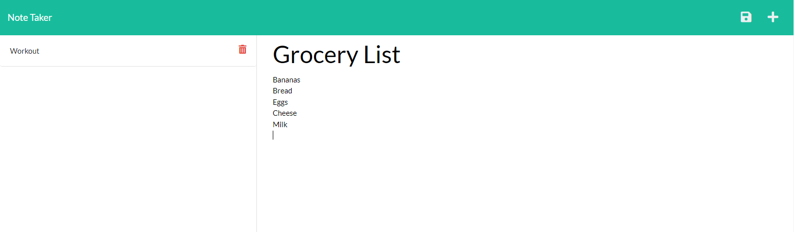

## Purpose
A note taking application that allows the ability to write and save notes. This application use express.js for back-end and saves and retrieves note data from a JSON file. This application is deployed on Heroku. 

## ScreenShot

## Github URL: 

## Legal Notice: 
© Adam T. Smith, U of M Coding Boot Camp 

Licensed under the [MIT license](LICENSE)

## Contributors: 
- Adam T. Smith <smith.adam937@gmail.com> 